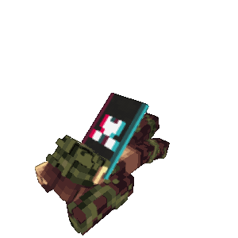
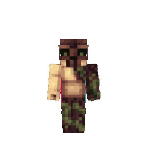
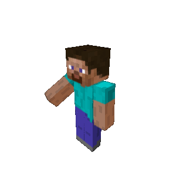
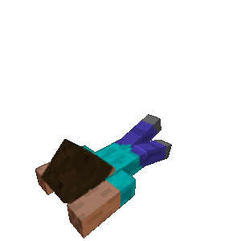
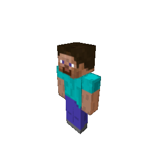
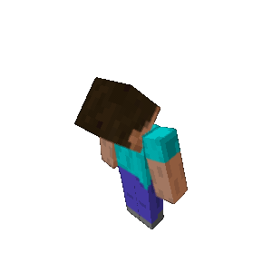
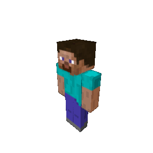

skinview3d-node
==========

> Fork note / 分支说明
>
> English:
> This fork is adapted from upstream `skinview3d` for server-side and offscreen rendering in Node.js. Compared with upstream, it replaces the browser-oriented rendering path with a backend-friendly implementation based on `skia-canvas` and headless WebGL, adds image/buffer export helpers for single-frame and animation rendering, and includes example pages plus a Vite plugin endpoint for testing backend rendering from the browser.
>
> 中文：
> 这个 fork 基于上游 `skinview3d`，主要改造成适用于 Node.js 的后端/离屏渲染版本。相对上游，它将原本面向浏览器的渲染链路适配为基于 `skia-canvas` 和 headless WebGL 的后端实现，增加了单帧与动画的图片/缓冲区导出能力，并提供了可通过 Vite 接口在浏览器中测试后端渲染的示例页面。


[](https://github.com/bs-community/skinview3d-node/actions?query=workflow:CI)
[](https://www.npmjs.com/package/skinview3d-node)
[](https://github.com/bs-community/skinview3d-node/blob/master/LICENSE)
[](https://gitter.im/skinview3d/Lobby)

Three.js powered Minecraft skin viewer.

## Examples / 输出示例

以下图片为当前项目导出的实际动画示例：

<p>
  
  
  
  
  
	
	
	
</p>

# Features

* 1.8 Skins
* HD Skins
* Capes
* Ears
* Elytras
* Slim Arms
  * Automatic model detection (Slim / Default)
* FXAA (fast approximate anti-aliasing)

# Usage

This fork is intended for Node.js backend rendering rather than direct browser embedding.

Install:

```bash
npm install skinview3d-node@latest
```

Render a single PNG frame:

```js
import { writeFileSync } from 'node:fs';
import { Vector3 } from 'three';
import { SkinViewer, WalkingAnimation } from 'skinview3d-node';
import gl from 'gl'

const glContext = gl(width, height, { preserveDrawingBuffer: true })
const width = 300
const height = 300
const mockCanvas = {
	width,
	height,
	style: {},
	addEventListener: () => {},
	removeEventListener: () => {},
	getContext: () => glContext
}

const skinViewer = new SkinViewer({
	canvas: mockCanvas as any,
	width,
	height,
	skin: './skin.png',
	cape: './cape.png',
	fov: 65,
	zoom: 0.8,
	pixelRatio: 1,
	preserveDrawingBuffer: true,
	animation: new WalkingAnimation()
});

await skinViewer.ready;

skinViewer.camera.position.set(25, 22, 25);
skinViewer.camera.lookAt(new Vector3(0, 5, 0));

writeFileSync('out.png', viewer.renderAnimationFrame(progress,true)());
skinViewer.dispose();
```

Render animation frames:

```js
import { writeFileSync } from 'node:fs';
import { SkinViewer, WalkAnimation } from 'skinview3d-node';
import gl from 'gl'

const glContext = gl(width, height, { preserveDrawingBuffer: true })
const width = 300
const height = 300
const mockCanvas = {
	width,
	height,
	style: {},
	addEventListener: () => {},
	removeEventListener: () => {},
	getContext: () => glContext
}

const skinViewer = new SkinViewer({
	canvas: mockCanvas as any,
	width,
	height,
	skin: './skin.png',
	animation: new SwimAnimation(),
	preserveDrawingBuffer: true
});

await skinViewer.ready;

const frames = skinViewer.renderAnimationLoop(60);
const arr: Uint8Array[] = [];
frames.forEach((frame, i) => {
	const buffer = frame();
	arr.push(buffer);
	// writeFileSync(`out/frame-${i}.png`, buffer)
});
const tmpgif = './output.gif' //path.join(os.tmpdir(), 'skinview3d_tmp.gif');
await framesToGif({
	width,
	height,
	frames: arr,
	outputPath: tmpgif,
	delay: WalkAnimation!.params.delay.value
});

skinViewer.dispose();
```

For local testing, this repository also provides an example Vite page at `examples/offscreen-render.html`.
It calls a Vite plugin endpoint to render single frames or full animations on the backend and preview the result in the browser.

## Lighting

By default, there are two lights on the scene. One is an ambient light, and the other is a point light from the camera.

To change the light intensity:

```js
skinViewer.cameraLight.intensity = 0.6;
skinViewer.globalLight.intensity = 3;
```

Setting `globalLight.intensity` to `3.0` and `cameraLight.intensity` to `0.0`
will completely disable shadows.

## Ears

skinview3d supports two types of ear texture:

* `standalone`: 14x7 image that contains the ear ([example](https://github.com/bs-community/skinview3d/blob/master/examples/public/img/ears.png))
* `skin`: Skin texture that contains the ear (e.g. [deadmau5&#39;s skin](https://minecraft.wiki/w/Easter_eggs#deadmau5's_ears))

Usage:

```js
// You can specify ears in the constructor:
new skinview3d.SkinViewer({
	skin: "img/deadmau5.png",

	// Use ears drawn on the current skin (img/deadmau5.png)
	ears: "current-skin",

	// Or use ears from other textures
	ears: {
		textureType: "standalone", // "standalone" or "skin"
		source: "img/ears.png"
	}
});

// Show ears when loading skins:
skinViewer.loadSkin("img/deadmau5.png", { ears: true });

// Use ears from other textures:
skinViewer.loadEars("img/ears.png", { textureType: "standalone" });
skinViewer.loadEars("img/deadmau5.png", { textureType: "skin" });
```

## Name Tag

Usage:

```js
// Name tag with text "hello"
skinViewer.nameTag = "hello";

// Specify the text color
skinViewer.nameTag = new skinview3d.NameTagObject("hello", { textStyle: "yellow" });

// Unset the name tag
skinViewer.nameTag = null;
```

In order to display name tags correctly, you need the `Minecraft` font from
[South-Paw/typeface-minecraft](https://github.com/South-Paw/typeface-minecraft).
This font is available at [`assets/minecraft.woff2`](assets/minecraft.woff2).

To load this font, please add the `@font-face` rule to your CSS:

```css
@font-face {
	font-family: 'Minecraft';
	src: url('/path/to/minecraft.woff2') format('woff2');
}
```

# Build

`npm run build`
